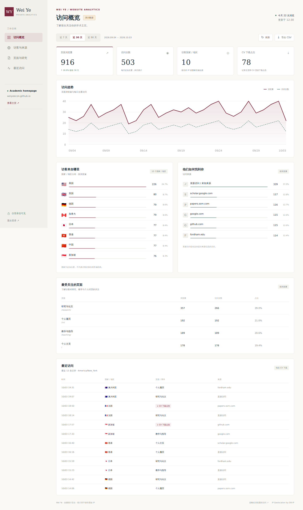

# Wei Ye · 私人访问统计

自建的访问采集服务和登录后台，与个人学术主页使用相同的米白、酒红配色。数据保存到自己服务器上的 SQLite 数据库；不使用 Flag Counter、Google Analytics 或其他第三方统计平台。



## Cloudflare 免服务器部署

已提供 [Cloudflare Workers + D1 版本](cloudflare/README.md)，可复用现有 `twilight-morning-f73e` Worker 和 `weiye-analytics-db` 数据库，支持国家、美国州和近似城市分布。先完成后端部署与登录验收，再开启主页采集。以下章节继续适用于原有 Python / SQLite 部署。

## 已实现

- 管理员密码登录，12 小时会话，到期重新登录；退出后会话立即失效。
- 近 7 / 30 / 90 天浏览量、每日近似去重访问、国家分布、访问来源和热门页面。
- CV 下载点击、最近 12 条访问、按日汇总的 CSV 导出。
- 登录失败限速、采集限速、跨站来源检查和严格的内容安全策略。
- 本地 IP 国家数据库。没有安装数据库时，国家显示为「未知」，其他统计正常。
- Docker Compose、HTTPS 反向代理、数据库备份和独立的本地演示环境。

**当前状态：代码可运行，真实网站采集尚未开启。** GitHub Pages 是静态托管，不能运行这个服务。可以选择上面的 Cloudflare 部署；以下 Python 方案需要自己的服务器、统计域名和 HTTPS，这些就绪后再填写网站的接入地址。

## 本机预览

要求 Python 3.12 或更高版本。在仓库根目录运行：

```sh
cd analytics
python3 -m venv .venv
.venv/bin/pip install -r requirements.txt
.venv/bin/python manage.py init --preview
.venv/bin/python -m dotenv -f .env.preview run -- .venv/bin/python manage.py seed-demo
.venv/bin/python -m dotenv -f .env.preview run -- .venv/bin/uvicorn app:create_app --factory --host 127.0.0.1 --port 8100 --no-proxy-headers --no-access-log
```

打开 http://127.0.0.1:8100/，用刚设置的密码登录。预览数据库与正式数据库分开，页面顶部始终标注「演示数据」，预览模式拒绝记录真实访问。没有默认管理员密码。

## 部署到自己的服务器

要求一台支持 Docker Compose 的 Linux 服务器，一个指向该服务器 IP 的域名，例如 `stats.your-domain.org`，以及开放的 80 / 443 端口。主页继续使用 GitHub Pages。

1. 把仓库下载到服务器，进入 `analytics/`。建立 Python 虚拟环境并安装依赖，然后运行 `python manage.py init`（使用虚拟环境中的 Python）。
2. 编辑生成的 `.env`，把 `ANALYTICS_DOMAIN` 改为自己的域名，同时把 `PUBLIC_ORIGIN` 改为完整的 `https://` 地址。`SITE_ORIGINS` 保持 `https://weiyeecon.github.io`。
3. 构建服务，并把国家数据库下载到自己的服务器：

```sh
docker compose build
docker compose run --rm app python manage.py geoip --month 2026-10
docker compose up -d
```

`--month` 使用提供商已发布的月份；如果当月数据库尚未发布，用上一月。国家数据采用 DB-IP Lite（CC BY 4.0），后台保留来源署名。数据库一次下载后在本地查找，不向 DB-IP 发送访客 IP。每月更新时重新运行下载命令，再执行 `docker compose restart app`。

4. 打开自己的统计域名并登录。Docker 只公开 HTTPS 代理端口，数据库和应用端口不直接对外开放。Caddy 自动管理 HTTPS 证书。
5. 在网站 `_config.yml` 填入地址并提交：

```yaml
self_hosted_analytics_url: "https://stats.your-domain.org"
```

网站正式构建后才加载自己的采集脚本，所有六个页面都会接入；脚本不显示计数器，不加载外部统计脚本。检查后台出现真实访问、CV 下载点击，再确认退出登录后数据接口返回 401。

## 指标定义和数据边界

- **浏览量**：可见网页每次加载产生一条记录。已识别的机器人、启用 DNT / GPC 的浏览器和主动忽略的浏览器不计入。
- **访问次数**：以每日更新的 HMAC 摘要对 IP 与浏览器特征近似去重，再跨日累加。它不是实名人数，也不是整个时段内去重的独立访客；共享 IP 或更换网络可能影响结果。
- **CV 下载点击**：网页上的 PDF 链接被点击；不表示下载一定完成，也不能记录直接打开 PDF 的人。
- **国家**：本地 IP 数据库的近似归属，VPN、代理和数据库覆盖会影响结果。不据此推断身份、机构或招聘单位。
- **来源**：仅保存来源域名；直接访问和未提供 Referer 的访问归入直接来源。
- 统计库不保存原始 IP、完整 User-Agent、查询参数或来源网址路径。访客端不写入追踪 Cookie。管理员登录使用 HttpOnly、SameSite=Strict 的会话 Cookie，正式环境使用 Secure。
- 访问明细保留 365 天，在收到新访问时清理过期记录。没有浏览器回传的访问和未运行 JavaScript 的访问无法计入；历史流量不能补录。
- 来源检查、路径白名单和限速减少异常写入，但公开网站的采集接口不能保证所有流量都来自真人。

管理员后台的「忽略此浏览器」链接会在**主页域名**设置本地排除开关。恢复计数时访问 `https://weiyeecon.github.io/#stats-include`。清理浏览器存储后需要重新排除。

## 备份与密码管理

```sh
docker compose exec app python manage.py backup
docker compose cp app:/app/data/backup-YYYYMMDD-HHMMSS.sqlite3 ./private-backup.sqlite3
```

备份使用 SQLite 备份接口，避免直接复制仍在写入的数据库。将数据库、备份和 `.env` 保存在私人位置；`.gitignore` 与 `.dockerignore` 已排除它们。`analytics/` 整个目录也从 GitHub Pages 构建中排除。

修改密码：把旧 `.env` 暂存到私人位置，重新运行 `manage.py init`，恢复域名配置后重启服务。新密钥会使旧登录会话失效。不要把密码、密码摘要或统计记录粘贴到公开仓库。

## 验证

```sh
.venv/bin/pip install -r requirements-dev.txt
.venv/bin/python -m unittest discover -s . -p 'test_*.py' -v
```

测试覆盖登录、会话失效、来源限制、采集去重、指标汇总、导出、限速和隐私字段。部署配置使用单个应用进程；如果改为多进程或大规模流量，需要替换进程内采集限速器并审查存储容量。
